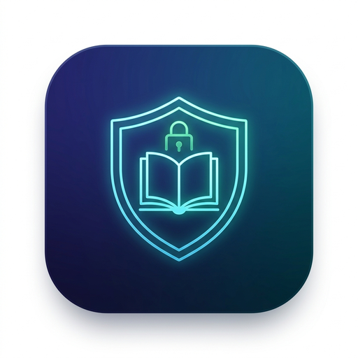

# 🚀 felixapel's Unraid Community Applications Templates

[](https://unraid.net)
[](LICENSE)
[](https://github.com/sponsors/felixapel)
[](https://ko-fi.com/felixapel)

Official Unraid Community Applications repository maintained by [felixapel](https://github.com/felixapel).

---

## 📦 Available Templates

### 🛡️ 1. Calibre Bookwarden (`calibre-bookwarden.xml`)
> **The Forensic Guardian for Calibre Libraries** — Content-grounded metadata verification, 360° deep audits, and high-fidelity cover triage.

<p align="center">
  
</p>

* **Core Philosophy**: *"The book file is the ground truth. LLMs are witnesses."*
* **Container Image**: `ghcr.io/felixapel/calibre-bookwarden:latest`
* **Web UI Port**: `8080` (maps to container `8080`)
* **Project Repository**: [felixapel/calibre-bookwarden](https://github.com/felixapel/calibre-bookwarden)

#### Key Capabilities:
* **Zero Hallucinations & Forensic Ground Truth**: Extracts exact metadata, title, author, and native covers directly from container files (`.epub`, `.pdf`, `.cbz`).
* **360° Forensic Audit Studio**: Deep inspection of author desyncs (`Author` vs `Author Sort`), broken paths, cover anomalies, and database hygiene.
* **Swipeable Cover Studio**: Side-by-side triage comparing current cover vs native embedded cover with Laplacian sharpness, Shannon entropy, and keyboard controls (<kbd>←</kbd> Skip, <kbd>→</kbd> Approve, <kbd>↑</kbd> Extract).
* **Curation Guardian**: **Series Gap Hunter** (detects missing book volumes) and **Duplicate Consolidator** (graphs cross-format duplicates).
* **Safety Invariant**: Operates in strict read-only mode by default (`BOOKWARDEN_READ_ONLY=true`) to guarantee zero risk of library corruption.

#### Default Port & Path Mappings:
| Parameter | Type | Container Path | Default Host Path / Value | Description |
| :--- | :--- | :--- | :--- | :--- |
| **WebUI Port** | Port | `8080` | `8080` | WebUI and REST API dashboard |
| **Calibre Library** | Path | `/calibre` | `/mnt/user/data/media/books` | Root Calibre library containing `metadata.db` |
| **Config & Artifacts** | Path | `/config` | `/mnt/user/appdata/calibre-bookwarden` | Persistent audit reports, cache, and state |
| **Read Only Mode** | Env | `BOOKWARDEN_READ_ONLY` | `true` | When true, mutations are strictly blocked |
| **Gemini API Key** | Env | `GEMINI_API_KEY` | *(Optional)* | For multimodal cover verification |

---

### 🌐 2. CWA eBook Translate
> **Bilingual Reading Companion** for [Calibre-Web-Automated](https://github.com/crocodilestick/Calibre-Web-Automated).

* Translate ebooks paragraph-by-paragraph *while you read*, in 100+ languages.
* Supports local LLMs (Ollama / vLLM / LM Studio) or cloud providers (Gemini, OpenAI, Claude).
* **Project Repository**: [felixapel/CWA-eBook-Translate-Plugin](https://github.com/felixapel/CWA-eBook-Translate-Plugin)

---

## 🛠️ How to Add to Unraid

1. Open your **Unraid WebGUI**.
2. Navigate to the **Docker** tab.
3. Scroll down to the bottom and locate **Template Repositories**.
4. Paste the URL of this repository:
   ```text
   https://github.com/felixapel/unraid-templates
   ```
5. Click **Save**.
6. Navigate to the **Apps** (Community Applications) tab, or click **Add Container** and select **calibre-bookwarden** from the template dropdown.

---

## 💖 Support & Contributions

If you find these self-hosted reading and library management tools useful in your homelab:
* 🌟 Star the repositories on GitHub!
* ☕ [Support via Ko-fi](https://ko-fi.com/felixapel)
* 💖 [Sponsor on GitHub](https://github.com/sponsors/felixapel)
